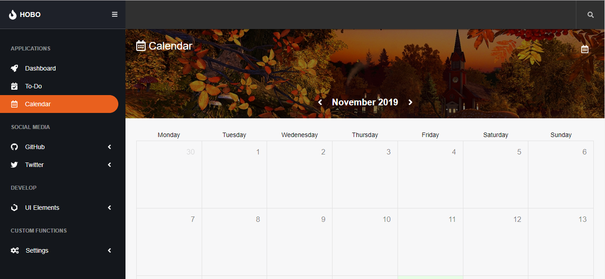

# [Calendar Dashboard](https://calendar-dashboard.netlify.com/#calendar)

The webapp is created totally in Vanilla JavaScript - EVERY. SINGLE. THING! 

The dashboard will/includes many common featues such as a Dashboard, ToDo, Calendar and more to come.
 
[Calendar Dashboard Demo](https://calendar-dashboard.netlify.com/#calendar)

## Motivation

I wanted to expand my knowledge of JavaScript and grasp new concepts, meanwhile at the same time learn about how Single Page Application works under the hood.

I have used ideas from React and Redux. Why? Because I get to use the entire JavaScript engine and use every single bit to get more practice with no abstraction. I used thing such as: Classes, Objects, Arrays of Objets, Functions for Objects, how to work with data, how exactly `this` works, and most importantly how to utilize all of that, to solve the problem I'm having.

I've also wanted to create a UI Library and really polish my architecture of CSS/Scss on a large project, which will allow me to get out from my comfort zone and expand. I've used front-end Methodologies such as BEM and properly set up each file, so it has the ability to scale, maintain and add new features in record time!

So, what is the best way to improve? Get an exciting project to work on and start outputting some code!

## Status

## Getting Started

These instructions will get you a copy of the project up and running on your local machine for development and testing purposes.

The webapp is deployed automatically to production mode on master. Any current development is made to the 'develop' branch.

## Installation

1. Clone this repo `git clone https://github.com/AurelianSpodarec/Calendar_Dashboard.git`
2. Run `npm install`

### Using this repo

For development work, run:

`npm start`

### Deployment

For a compiled file run:

`npm run build`

## Technologies used

* ES6 Support via [babel](https://babeljs.io/) (v7)
* SASS Support via [sass-loader](https://github.com/jtangelder/sass-loader)
* Linting via [eslint-loader](https://github.com/MoOx/eslint-loader)

## Creators

### Aurelian Spodarec
- [LinkedIn](https://www.linkedin.com/in/aurelianspodarec/)
- [Github](https://github.com/AurelianSpodarec)
- [Portfolio](http://aurelianspodarec.co.uk/)
- [Blog](http://lovetocode.com/)
- [New blog](https://creativeprogrammer.io/)

## Contributing

Feel free to file a PR if you want to help improve this project :)

## Licence

You can freely use any bits of code you want.

MIT © Aurelian Spodarec
